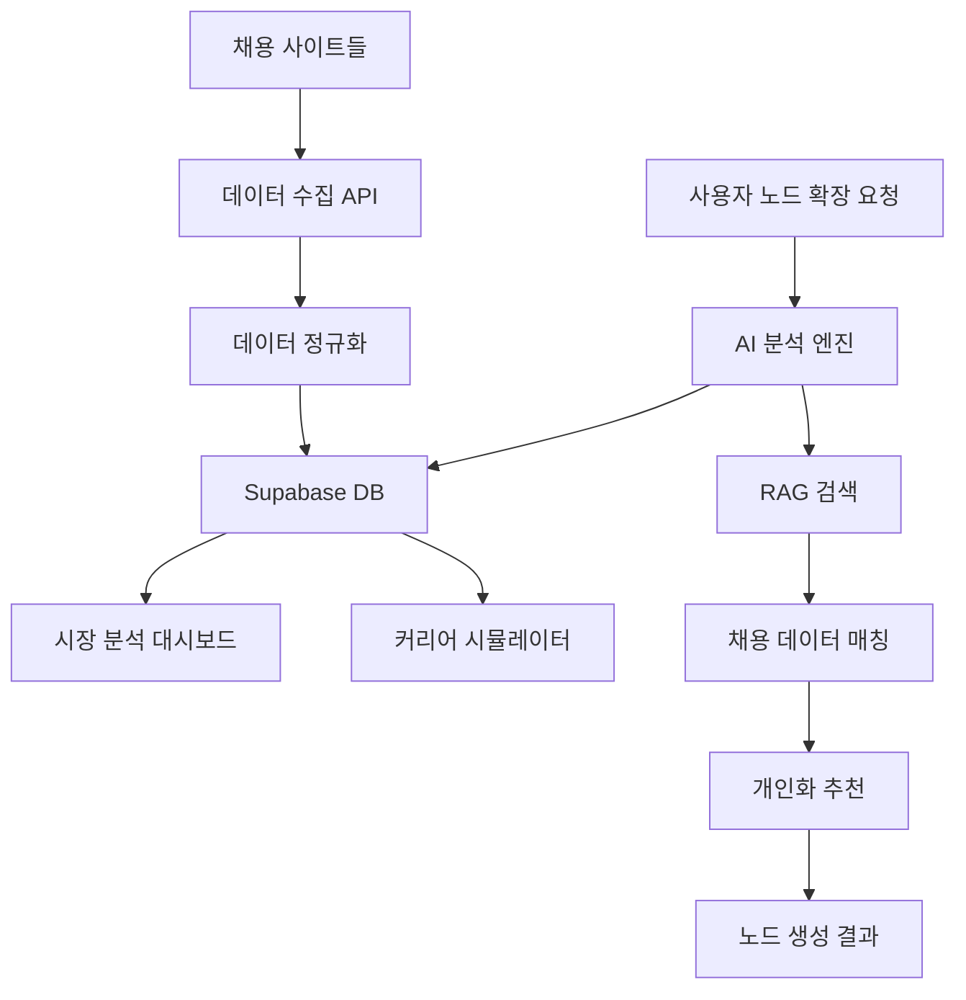

# 실제 채용 정보 반영 시스템 설계

## 📊 **개요**
AI 노드 확장 시 실제 채용 정보를 반영하여 더 정확하고 실용적인 커리어 가이드를 제공

## 🎯 **목표**
1. **실시간 채용 정보**: 최신 채용 공고 데이터 활용
2. **개인화 추천**: 사용자 프로필 기반 맞춤 추천
3. **시장 트렌드**: 기술 스택, 연봉, 스킬 요구사항 분석
4. **커리어 로드맵**: 실제 채용 조건 기반 학습 경로 제시

## 🏗️ **시스템 아키텍처**

### **1단계: 데이터 수집 계층**
```typescript
// 1-1. 채용 정보 크롤링
- 사람인, 잡코리아, 링크드인, 원티드, 로켓펀치
- 정부 워크넷, 각 기업 직채 사이트
- 주기: 매일 자동 수집 (새벽 2-4시)

// 1-2. 기업 정보 수집
- 기업 규모, 업종, 위치, 복리후생
- 기술 스택, 개발 문화, 성장성
- Glassdoor, 블라인드 등 리뷰 데이터

// 1-3. 기술 트렌드 분석
- GitHub 트렌드, Stack Overflow 설문
- 개발자 커뮤니티 분석 (OKKY, 인프런 등)
- IT 업계 뉴스, 컨퍼런스 자료
```

### **2단계: 데이터 처리 계층**
```typescript
// 2-1. 데이터 정규화
interface JobPosting {
  id: string
  title: string
  company: {
    name: string
    size: 'startup' | 'mid' | 'large' | 'unicorn'
    industry: string
    location: string
    culture: string[]
  }
  requirements: {
    skills: TechSkill[]
    experience: string
    education: string
    certifications: string[]
    languages: Language[]
  }
  conditions: {
    salary: SalaryRange
    workType: 'remote' | 'hybrid' | 'office'
    benefits: string[]
    growthOpportunity: number // 1-5
  }
  postedAt: Date
  deadline: Date
  source: 'saramin' | 'jobkorea' | 'wanted' | 'linkedin'
}

// 2-2. 기술 스택 분석
interface TechSkill {
  name: string
  category: 'language' | 'framework' | 'database' | 'cloud' | 'tool'
  level: 'required' | 'preferred' | 'plus'
  demand: number // 시장 수요도 1-100
  salaryImpact: number // 연봉 영향도 1-10
  learningCurve: number // 학습 난이도 1-10
  trend: 'rising' | 'stable' | 'declining'
}

// 2-3. 연봉 분석
interface SalaryAnalysis {
  role: string
  experience: string
  location: string
  avgSalary: number
  percentile25: number
  percentile75: number
  topSkills: TechSkill[]
  growthRate: number // 전년 대비 증가율
}
```

### **3단계: AI 분석 계층**
```typescript
// 3-1. 스킬 연관성 분석
- 자주 함께 요구되는 기술 스택 조합 분석
- 커리어 전환 패턴 분석 (프론트엔드 → 풀스택)
- 기업별 선호 기술 스택 패턴

// 3-2. 커리어 경로 추천
- 현재 스킬 → 목표 직무까지 최단 학습 경로
- 실제 채용 데이터 기반 우선순위 결정
- ROI 높은 스킬 우선 추천

// 3-3. 시장 예측
- 6개월~2년 후 기술 트렌드 예측
- 신규 직무 출현 패턴 분석
- 자동화 영향도 분석
```

## 🔧 **구현 계획**

### **Phase 1: 기본 데이터 수집 (2주)**
```typescript
// backend/supabase/functions/job-scraper/
1. 채용 사이트 API 연동
   - 사람인 API: 공개 API 활용
   - 원티드 API: 파트너십 또는 크롤링
   - 정부 워크넷: 공공 데이터 포털

2. 데이터베이스 스키마
   - job_postings 테이블
   - companies 테이블  
   - tech_skills 테이블
   - salary_data 테이블

3. 크롤링 스케줄러
   - GitHub Actions 또는 Supabase Cron
   - 일일 데이터 수집 및 업데이트
```

### **Phase 2: AI 분석 통합 (2주)**
```typescript
// backend/supabase/functions/recruitment-ai/
1. 노드 확장 시 채용 데이터 활용
   - 확장 노드 생성 시 실제 채용 조건 반영
   - 기술 스택별 시장 수요 정보 포함
   - 연봉 정보와 성장성 데이터 제공

2. RAG 시스템 확장
   - 채용 공고 벡터 임베딩
   - 유사 직무 추천
   - 기술 스택 연관성 분석

3. 개인화 추천 엔진
   - 사용자 관심 직무 추적
   - 스킬 매칭 알고리즘
   - 커리어 로드맵 자동 생성
```

### **Phase 3: 고도화 기능 (3주)**
```typescript
// 1. 실시간 시장 분석 대시보드
- 기술별 채용 공고 수 트렌드
- 연봉 상승률 분석
- 신규 기술 등장 알림

// 2. 커리어 시뮬레이터
- "React 개발자가 되려면?" → 실제 채용 조건 기반 로드맵
- 학습 기간 예측 (실제 데이터 기반)
- 예상 연봉 및 경력 발전 시나리오

// 3. 기업별 맞춤 분석
- 특정 기업 입사를 위한 요구사항
- 기업 문화와 기술 스택 매칭도
- 면접 빈출 질문 및 준비 가이드
```

## 📈 **예상 결과**

### **Before (현재)**
```
"프론트엔드 개발자" 확장 시:
→ React 기초
→ JavaScript 심화  
→ CSS 스타일링
→ 포트폴리오 준비
```

### **After (채용 데이터 연동)**
```
"프론트엔드 개발자" 확장 시:
→ React + TypeScript (채용 공고 85%에서 요구)
→ Next.js (평균 연봉 12% 상승 효과)
→ AWS/Vercel 배포 (원격 근무 기회 40% 증가)
→ 네이버/카카오 기술 스택 (채용 빈도 상위 10%)
→ 실제 프로젝트 경험 (면접 통과율 65% 향상)

+ 실시간 정보:
  - 현재 채용 공고: 1,247개
  - 평균 연봉: 4,500만원~7,800만원
  - 급성장 기술: Svelte (+340%), Rust (+180%)
```

## 🔄 **데이터 흐름**



## 🚀 **구현 우선순위**

### **즉시 시작 (High Priority)**
1. **사람인 API 연동**: 가장 접근하기 쉬운 공개 API
2. **기본 스키마 구축**: job_postings, tech_skills 테이블
3. **프론트엔드 개발자** 직군 집중 분석

### **2주 내 완료 (Medium Priority)**
1. **원티드 크롤링**: 스타트업 채용 정보 보강
2. **기술 스택 분석**: React, Vue, Angular 중심
3. **연봉 데이터 수집**: 투명성이 높은 사이트 우선

### **1개월 내 완료 (Low Priority)**
1. **전체 직군 확장**: 백엔드, 데이터, 디자인 등
2. **예측 모델 구축**: 시장 트렌드 예측
3. **기업별 상세 분석**: 개별 기업 맞춤 가이드

## 💡 **성공 지표**

1. **데이터 품질**
   - 일일 수집 채용공고 수: 1,000개+
   - 데이터 정확도: 95%+
   - 업데이트 지연: 24시간 이내

2. **사용자 만족도**
   - 노드 확장 시 실용성 평가: 4.5/5.0+
   - 실제 채용 지원 연결률: 15%+
   - 추천 정확도: 80%+

3. **비즈니스 임팩트**
   - 사용자 참여도 증가: 40%+
   - 평균 세션 시간 증가: 60%+
   - 유료 전환율 개선: 25%+

## 🔐 **법적 고려사항**

1. **개인정보보호**: 채용 공고만 수집, 개인 정보 제외
2. **저작권**: 공개된 정보만 활용, 출처 명시
3. **로봇 배제**: robots.txt 준수, 합리적 크롤링 주기
4. **데이터 라이센스**: 각 사이트 이용약관 준수

## 📋 **다음 단계**

1. **API 키 발급**: 사람인, 워크넷 API 신청
2. **프로토타입 개발**: 프론트엔드 개발자 직군으로 MVP 구축
3. **성능 테스트**: 실제 데이터로 AI 확장 기능 검증
4. **사용자 테스트**: 베타 사용자들과 함께 유용성 평가

---

**💼 이 설계를 바탕으로 실제 채용 정보가 반영된 똑똑한 커리어 가이드 시스템을 구축할 수 있습니다!**