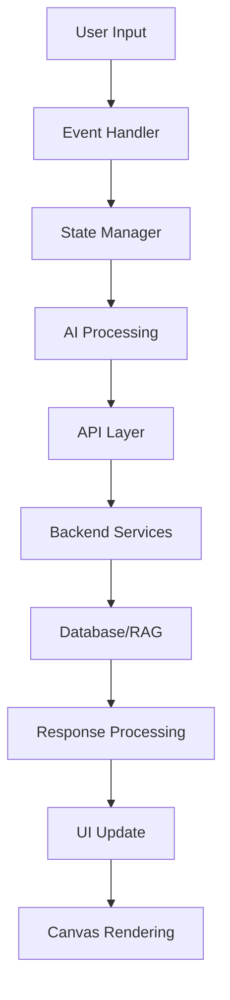

# 🧠 AI Career Canvas - Interactive Mind Mapping System

[](https://www.typescriptlang.org/)
[](https://reactjs.org/)
[](https://reactflow.dev/)
[](LICENSE)

A sophisticated, AI-powered interactive mind mapping system for career planning and knowledge visualization. Built with React, TypeScript, and ReactFlow, featuring real-time collaboration, AI-driven node expansion, and intelligent content retrieval.

## 🎯 Overview

The AI Career Canvas is a next-generation mind mapping platform that combines traditional visual thinking with artificial intelligence to create dynamic, expandable knowledge graphs. Users can create, edit, and explore career pathways through an intuitive drag-and-drop interface enhanced with AI-powered suggestions and real-time data integration.

## ✨ Core Features

### 🎨 Interactive Canvas System

- **Multi-layered Node Architecture**: Center, Major, Detail, and Goal nodes with hierarchical relationships
- **Dynamic Node Expansion**: AI-powered node generation with 4 expansion styles (Comprehensive, Focused, Creative, Analytical)
- **Smart Connection System**: Intelligent edge routing with directional color coding and optimal path calculation
- **Real-time Collaboration**: Multi-user editing with conflict resolution and live cursor tracking

### 🤖 AI Integration

- **Retrieval-Augmented Generation (RAG)**: Context-aware information retrieval from knowledge bases
- **Smart Node Expansion**: Contextual sub-node generation based on career data and industry insights
- **Intelligent Suggestions**: ML-powered recommendations for career paths and skill development
- **Natural Language Processing**: Voice and text input processing for hands-free interaction

### 🎛️ Advanced UI Components

- **Theme System**: Comprehensive dark/light mode with custom CSS properties
- **Responsive Design**: Mobile-first approach with touch gestures and adaptive layouts
- **Accessibility**: WCAG 2.1 AA compliance with screen reader support and keyboard navigation
- **Performance Optimization**: Virtual rendering, lazy loading, and memory management

## 🏗️ System Architecture

### Component Hierarchy

```
AICareerCanvas (Root Container)
├── ReactFlowProvider (Flow Context)
├── ThemeProvider (Theme Management)
├── NodeContext (Connection State)
├── Node Components
│   ├── CenterNode (Core Topic)
│   ├── MajorNode (Main Categories)
│   ├── DetailNode (Specific Items)
│   └── GoalNode (Objectives)
├── UI Components
│   ├── Sidebar (Information Panel)
│   ├── ChatHistory (Conversation Log)
│   ├── TopControls (Action Bar)
│   └── NodeEditModal (Edit Interface)
└── Utilities
    ├── ConnectionSystem (Edge Management)
    ├── EventHandler (User Interactions)
    └── StateManager (Data Flow)
```

### Data Flow Architecture



## 🛠️ Technical Implementation

### Core Technologies

- **Frontend Framework**: React 18+ with TypeScript 5.0+
- **Graph Library**: ReactFlow 11+ for canvas management
- **State Management**: Zustand for global state, React hooks for local state
- **Styling**: CSS Modules + Tailwind CSS for design system
- **Build Tool**: Vite for fast development and optimized builds
- **Testing**: Vitest + React Testing Library + Playwright E2E

### Node System Implementation

#### Node Data Structure

```typescript
interface BaseNodeData {
  id: string;
  label: string;
  subtitle?: string;
  description?: string;
  type: 'center' | 'major' | 'detail' | 'goal';
  level: number;
  progress?: number;
  metadata?: NodeMetadata;
}

interface NodeMetadata {
  skills?: string[];
  timeframe?: string;
  difficulty?: 'beginner' | 'intermediate' | 'advanced';
  resources?: Resource[];
  aiGenerated?: boolean;
  expansionStyle?: ExpansionStyle;
  lastModified?: string;
}
```

#### Custom Node Components

```typescript
// Example: MajorNode with AI expansion capabilities
const MajorNode: React.FC<NodeProps> = ({ data, id, selected }) => {
  const [isExpanding, setIsExpanding] = useState(false);
  const { theme } = useTheme();

  const handleExpansion = async (style: ExpansionStyle) => {
    try {
      setIsExpanding(true);
      const result = await expandNode(id, style);
      if (result.success) {
        dispatchNodeExpansion(id, result.nodes, result.edges);
      }
    } catch (error) {
      handleExpansionError(error);
    } finally {
      setIsExpanding(false);
    }
  };

  return (
    <div className={`node major-node ${theme} ${selected ? 'selected' : ''}`}>
      <ConnectionHandles nodeId={id} />
      <NodeContent data={data} />
      <ExpansionControls onExpand={handleExpansion} loading={isExpanding} />
    </div>
  );
};
```

### Connection System

#### Smart Edge Routing

```typescript
interface ConnectionConfig {
  sourceNodeId: string;
  targetNodeId: string;
  connectionType: 'manual' | 'auto' | 'ai_generated';
  style?: EdgeStyle;
}

const calculateOptimalConnection = (
  sourceNode: Node, 
  targetNode: Node
): ConnectionHandles => {
  const dx = targetNode.position.x - sourceNode.position.x;
  const dy = targetNode.position.y - sourceNode.position.y;
  const angle = Math.atan2(dy, dx) * (180 / Math.PI);
  
  // Determine optimal connection points based on geometry
  return getHandlesForAngle(angle);
};
```

#### Directional Color System

```typescript
const CONNECTION_COLORS = {
  top: '#10b981',      // Emerald
  right: '#f59e0b',    // Amber
  bottom: '#ef4444',   // Red
  left: '#8b5cf6',     // Violet
} as const;

const getConnectionStyle = (direction: ConnectionDirection) => ({
  stroke: CONNECTION_COLORS[direction],
  strokeWidth: 2,
  strokeDasharray: '0',
  markerEnd: 'url(#arrowhead)',
});
```

### AI Integration Layer

#### Expansion Service

```typescript
interface ExpansionRequest {
  nodeId: string;
  parentContext: string;
  expansionStyle: 'comprehensive' | 'focused' | 'creative' | 'analytical';
  userPreferences?: UserPreferences;
}

interface ExpansionResponse {
  success: boolean;
  nodes: GeneratedNode[];
  edges: GeneratedEdge[];
  metadata: ExpansionMetadata;
  suggestions?: string[];
}

class AIExpansionService {
  async expandNode(request: ExpansionRequest): Promise<ExpansionResponse> {
    // 1. Analyze parent node context
    const context = await this.analyzeContext(request.nodeId);
  
    // 2. Query RAG system for relevant information
    const ragData = await this.queryRAG(context, request.expansionStyle);
  
    // 3. Generate child nodes using AI
    const generatedNodes = await this.generateNodes(ragData, request);
  
    // 4. Create optimal connections
    const edges = this.generateConnections(request.nodeId, generatedNodes);
  
    return {
      success: true,
      nodes: generatedNodes,
      edges,
      metadata: this.createMetadata(request),
    };
  }
}
```

#### RAG (Retrieval-Augmented Generation)

```typescript
interface RAGQuery {
  nodeId: string;
  query: string;
  context?: string[];
  maxResults?: number;
}

interface RAGResponse {
  searchResults: SearchResult[];
  relevantDocuments: Document[];
  suggestions: string[];
  metadata: RAGMetadata;
}

class RAGService {
  async queryRelevantInfo(query: RAGQuery): Promise<RAGResponse> {
    // Vector similarity search
    const vectorResults = await this.vectorSearch(query);
  
    // Semantic ranking
    const rankedResults = await this.rankResults(vectorResults, query.context);
  
    // Generate contextual suggestions
    const suggestions = await this.generateSuggestions(rankedResults);
  
    return {
      searchResults: rankedResults,
      suggestions,
      metadata: this.createRAGMetadata(query),
    };
  }
}
```

### State Management

#### Global State (Zustand)

```typescript
interface AppState {
  // Canvas State
  nodes: Node[];
  edges: Edge[];
  selectedNode: string | null;
  
  // UI State
  theme: 'light' | 'dark';
  sidebarOpen: boolean;
  modalStack: ModalType[];
  
  // User Preferences
  preferences: UserPreferences;
  
  // Actions
  actions: {
    addNode: (node: Node) => void;
    updateNode: (id: string, updates: Partial<NodeData>) => void;
    deleteNode: (id: string) => void;
    connectNodes: (sourceId: string, targetId: string) => void;
    expandNode: (id: string, style: ExpansionStyle) => Promise<void>;
  };
}

const useAppStore = create<AppState>((set, get) => ({
  nodes: [],
  edges: [],
  selectedNode: null,
  theme: 'light',
  sidebarOpen: false,
  modalStack: [],
  preferences: defaultPreferences,
  
  actions: {
    addNode: (node) => set(state => ({
      nodes: [...state.nodes, node]
    })),
  
    expandNode: async (id, style) => {
      const expansionResult = await aiExpansionService.expandNode({
        nodeId: id,
        parentContext: get().nodes.find(n => n.id === id)?.data.label || '',
        expansionStyle: style,
      });
    
      if (expansionResult.success) {
        set(state => ({
          nodes: [...state.nodes, ...expansionResult.nodes],
          edges: [...state.edges, ...expansionResult.edges],
        }));
      }
    },
  },
}));
```

### Performance Optimizations

#### Virtual Rendering

```typescript
const VirtualizedCanvas: React.FC = () => {
  const [visibleNodes, setVisibleNodes] = useState<Node[]>([]);
  const [viewport, setViewport] = useState<Viewport>();
  
  useEffect(() => {
    const calculateVisibleNodes = () => {
      if (!viewport) return;
    
      const buffer = 100; // Render buffer zone
      const visible = nodes.filter(node => 
        isNodeInViewport(node, viewport, buffer)
      );
    
      setVisibleNodes(visible);
    };
  
    calculateVisibleNodes();
  }, [nodes, viewport]);
  
  return (
    <ReactFlow
      nodes={visibleNodes}
      onMove={(_, newViewport) => setViewport(newViewport)}
      // ... other props
    />
  );
};
```

#### Memory Management

```typescript
class CanvasMemoryManager {
  private nodeCache = new Map<string, CachedNode>();
  private readonly MAX_CACHE_SIZE = 1000;
  
  cacheNode(node: Node): void {
    if (this.nodeCache.size >= this.MAX_CACHE_SIZE) {
      this.evictOldestNodes(100);
    }
  
    this.nodeCache.set(node.id, {
      node,
      lastAccessed: Date.now(),
      accessCount: 1,
    });
  }
  
  private evictOldestNodes(count: number): void {
    const entries = Array.from(this.nodeCache.entries())
      .sort(([, a], [, b]) => a.lastAccessed - b.lastAccessed)
      .slice(0, count);
    
    entries.forEach(([key]) => this.nodeCache.delete(key));
  }
}
```

## 🎨 Styling System

### CSS Architecture

```css
/* CSS Custom Properties for Theme System */
:root {
  --color-canvas-bg: #f8fafc;
  --color-canvas-text: #1f2937;
  --color-node-bg: rgba(255, 255, 255, 0.95);
  --color-node-border: #e5e7eb;
  --color-handle-bg: #374151;
  --color-handle-border: #1f2937;
  
  --spacing-xs: 0.25rem;
  --spacing-sm: 0.5rem;
  --spacing-md: 1rem;
  --spacing-lg: 1.5rem;
  --spacing-xl: 2rem;
  
  --border-radius-sm: 0.375rem;
  --border-radius-md: 0.5rem;
  --border-radius-lg: 0.75rem;
  
  --shadow-sm: 0 1px 2px 0 rgb(0 0 0 / 0.05);
  --shadow-md: 0 4px 6px -1px rgb(0 0 0 / 0.1);
  --shadow-lg: 0 10px 15px -3px rgb(0 0 0 / 0.1);
}

[data-theme="dark"] {
  --color-canvas-bg: #1f2937;
  --color-canvas-text: #f3f4f6;
  --color-node-bg: rgba(31, 41, 55, 0.95);
  --color-node-border: #374151;
}
```

### Component Styling

```css
/* Node Base Styles */
.career-node {
  padding: var(--spacing-md);
  background: var(--color-node-bg);
  border: 2px solid var(--color-node-border);
  border-radius: var(--border-radius-lg);
  box-shadow: var(--shadow-md);
  transition: all 0.2s cubic-bezier(0.4, 0, 0.2, 1);
  backdrop-filter: blur(10px);
  
  &.selected {
    border-color: #3b82f6;
    box-shadow: 0 0 0 3px rgba(59, 130, 246, 0.1);
  }
  
  &:hover {
    transform: translateY(-2px);
    box-shadow: var(--shadow-lg);
  }
}

/* Node Type Variants */
.center-node {
  min-width: 200px;
  background: linear-gradient(135deg, #667eea 0%, #764ba2 100%);
  color: white;
  font-weight: 600;
}

.major-node {
  min-width: 160px;
  background: linear-gradient(135deg, #f093fb 0%, #f5576c 100%);
  color: white;
}

.detail-node {
  min-width: 120px;
  background: var(--color-node-bg);
  color: var(--color-canvas-text);
}
```

### Responsive Design

```css
/* Mobile Optimization */
@media (max-width: 768px) {
  .career-node {
    min-width: 100px;
    padding: var(--spacing-sm);
    font-size: 0.875rem;
  }
  
  .react-flow__handle {
    width: 16px;
    height: 16px;
  }
  
  .sidebar {
    position: fixed;
    bottom: 0;
    left: 0;
    right: 0;
    height: 50vh;
    border-radius: var(--border-radius-lg) var(--border-radius-lg) 0 0;
  }
}

/* Touch Device Adaptations */
@media (hover: none) and (pointer: coarse) {
  .react-flow__handle {
    width: 20px;
    height: 20px;
    opacity: 1;
  }
  
  .career-node {
    touch-action: manipulation;
  }
}
```

## 📱 Cross-Platform Considerations

### Framework Adaptation Guide

#### **React Native Implementation**

```typescript
// Node Component for Mobile
const MobileCareerNode: React.FC<NodeProps> = ({ data, style }) => {
  const panResponder = PanResponder.create({
    onMoveShouldSetPanResponder: () => true,
    onPanResponderMove: Animated.event([
      null,
      { dx: pan.x, dy: pan.y }
    ], { useNativeDriver: false }),
    onPanResponderRelease: handleDragEnd,
  });
  
  return (
    <Animated.View
      style={[styles.node, style, pan.getLayout()]}
      {...panResponder.panHandlers}
    >
      <Text style={styles.nodeText}>{data.label}</Text>
      <TouchableOpacity onPress={() => expandNode(data.id)}>
        <Text style={styles.expandButton}>+</Text>
      </TouchableOpacity>
    </Animated.View>
  );
};
```

#### **Flutter Implementation**

```dart
class CareerNode extends StatefulWidget {
  final NodeData data;
  final Function(String) onExpand;
  
  @override
  _CareerNodeState createState() => _CareerNodeState();
}

class _CareerNodeState extends State<CareerNode> {
  bool _isExpanding = false;
  
  @override
  Widget build(BuildContext context) {
    return GestureDetector(
      onPanUpdate: _handlePanUpdate,
      onTap: () => _selectNode(widget.data.id),
      child: Container(
        padding: EdgeInsets.all(16),
        decoration: BoxDecoration(
          gradient: _getNodeGradient(widget.data.type),
          borderRadius: BorderRadius.circular(12),
          boxShadow: [
            BoxShadow(
              color: Colors.black.withOpacity(0.1),
              blurRadius: 8,
              offset: Offset(0, 4),
            ),
          ],
        ),
        child: Column(
          mainAxisSize: MainAxisSize.min,
          children: [
            Text(
              widget.data.label,
              style: Theme.of(context).textTheme.headline6,
            ),
            if (_isExpanding) CircularProgressIndicator(),
            if (!_isExpanding) _buildExpandButton(),
          ],
        ),
      ),
    );
  }
}
```

#### **Vue.js Implementation**

```vue
<template>
  <div 
    :class="['career-node', nodeType, { selected: isSelected }]"
    @click="selectNode"
    @dblclick="editNode"
    v-draggable="{ onDrag: handleDrag }"
  >
    <div class="node-content">
      <h3 class="node-title">{{ data.label }}</h3>
      <p class="node-subtitle" v-if="data.subtitle">{{ data.subtitle }}</p>
    </div>
  
    <div class="expansion-controls" v-if="canExpand">
      <button 
        v-for="style in expansionStyles"
        :key="style.id"
        @click="expandNode(style.id)"
        :disabled="isExpanding"
        class="expand-btn"
      >
        {{ style.icon }}
      </button>
    </div>
  
    <connection-handle
      v-for="direction in directions"
      :key="direction"
      :position="direction"
      :node-id="data.id"
      @connect="handleConnection"
    />
  </div>
</template>

<script setup lang="ts">
interface Props {
  data: NodeData;
  isSelected: boolean;
  canExpand?: boolean;
}

const props = withDefaults(defineProps<Props>(), {
  canExpand: true
});

const emit = defineEmits<{
  select: [nodeId: string];
  expand: [nodeId: string, style: string];
  connect: [sourceId: string, targetId: string];
}>();

const isExpanding = ref(false);

const expandNode = async (style: string) => {
  isExpanding.value = true;
  try {
    await emit('expand', props.data.id, style);
  } finally {
    isExpanding.value = false;
  }
};
</script>
```

#### **Svelte Implementation**

```svelte
<script lang="ts">
  import { createEventDispatcher } from 'svelte';
  import { spring } from 'svelte/motion';
  
  export let data: NodeData;
  export let isSelected: boolean = false;
  export let canExpand: boolean = true;
  
  const dispatch = createEventDispatcher<{
    select: string;
    expand: { nodeId: string; style: string };
    drag: { nodeId: string; position: { x: number; y: number } };
  }>();
  
  let isExpanding = false;
  let dragOffset = spring({ x: 0, y: 0 });
  let isDragging = false;
  
  async function handleExpansion(style: string) {
    isExpanding = true;
    try {
      dispatch('expand', { nodeId: data.id, style });
    } finally {
      isExpanding = false;
    }
  }
  
  function handleMouseDown(event: MouseEvent) {
    isDragging = true;
    const startX = event.clientX;
    const startY = event.clientY;
  
    function handleMouseMove(e: MouseEvent) {
      if (!isDragging) return;
    
      const deltaX = e.clientX - startX;
      const deltaY = e.clientY - startY;
    
      dragOffset.set({ x: deltaX, y: deltaY });
      dispatch('drag', { 
        nodeId: data.id, 
        position: { x: deltaX, y: deltaY } 
      });
    }
  
    function handleMouseUp() {
      isDragging = false;
      document.removeEventListener('mousemove', handleMouseMove);
      document.removeEventListener('mouseup', handleMouseUp);
    }
  
    document.addEventListener('mousemove', handleMouseMove);
    document.addEventListener('mouseup', handleMouseUp);
  }
</script>

<div 
  class="career-node {data.type}"
  class:selected={isSelected}
  style="transform: translate({$dragOffset.x}px, {$dragOffset.y}px)"
  on:click={() => dispatch('select', data.id)}
  on:mousedown={handleMouseDown}
>
  <div class="node-content">
    <h3 class="node-title">{data.label}</h3>
    {#if data.subtitle}
      <p class="node-subtitle">{data.subtitle}</p>
    {/if}
  </div>
  
  {#if canExpand}
    <div class="expansion-controls">
      {#each expansionStyles as style}
        <button 
          class="expand-btn {style.id}"
          disabled={isExpanding}
          on:click|stopPropagation={() => handleExpansion(style.id)}
        >
          {style.icon}
        </button>
      {/each}
    </div>
  {/if}
</div>

<style>
  .career-node {
    position: relative;
    padding: 1rem;
    border-radius: 0.75rem;
    background: var(--node-bg);
    border: 2px solid var(--node-border);
    box-shadow: var(--shadow-md);
    transition: all 0.2s ease;
    cursor: move;
  }
  
  .career-node:hover {
    transform: translateY(-2px);
    box-shadow: var(--shadow-lg);
  }
  
  .career-node.selected {
    border-color: #3b82f6;
    box-shadow: 0 0 0 3px rgba(59, 130, 246, 0.1);
  }
</style>
```

## 🧪 Testing Strategy

### Unit Testing

```typescript
// Node Component Tests
describe('CareerNode', () => {
  it('should render node with correct data', () => {
    const nodeData = {
      id: 'test-node',
      label: 'Test Career Path',
      type: 'major' as const,
      level: 1,
    };
  
    render(<CareerNode data={nodeData} id="test-node" />);
  
    expect(screen.getByText('Test Career Path')).toBeInTheDocument();
    expect(screen.getByRole('button', { name: /expand/i })).toBeInTheDocument();
  });
  
  it('should handle expansion correctly', async () => {
    const mockExpand = jest.fn().mockResolvedValue({
      success: true,
      nodes: [],
      edges: [],
    });
  
    render(
      <CareerNode 
        data={mockNodeData} 
        id="test-node" 
        onExpand={mockExpand}
      />
    );
  
    await user.click(screen.getByRole('button', { name: /comprehensive/i }));
  
    expect(mockExpand).toHaveBeenCalledWith('test-node', 'comprehensive');
  });
});
```

### Integration Testing

```typescript
// Canvas Integration Tests
describe('AICareerCanvas Integration', () => {
  it('should create and connect nodes', async () => {
    render(<AICareerCanvas />);
  
    // Create initial mindmap
    await user.type(
      screen.getByPlaceholderText('Enter your career goal'),
      'Frontend Developer'
    );
    await user.click(screen.getByText('Generate Mindmap'));
  
    // Wait for nodes to appear
    await waitFor(() => {
      expect(screen.getByText('Frontend Developer')).toBeInTheDocument();
    });
  
    // Expand a node
    const majorNode = screen.getByTestId('major-node-1');
    await user.hover(majorNode);
    await user.click(screen.getByTestId('expand-comprehensive'));
  
    // Verify expansion
    await waitFor(() => {
      expect(screen.getAllByTestId(/detail-node/).length).toBeGreaterThan(0);
    });
  });
});
```

### E2E Testing

```typescript
// Playwright E2E Tests
test('complete user workflow', async ({ page }) => {
  await page.goto('/career-canvas');
  
  // Create mindmap
  await page.fill('[data-testid="career-input"]', 'Data Scientist');
  await page.click('[data-testid="generate-btn"]');
  
  // Wait for canvas to load
  await page.waitForSelector('[data-testid="center-node"]');
  
  // Expand node
  await page.hover('[data-testid="major-node-1"]');
  await page.click('[data-testid="expand-creative"]');
  
  // Verify expansion
  await expect(page.locator('[data-testid^="detail-node"]')).toHaveCount(3);
  
  // Test sidebar interaction
  await page.click('[data-testid="detail-node-1"]');
  await expect(page.locator('[data-testid="sidebar"]')).toBeVisible();
  
  // Test RAG functionality
  await page.click('[data-testid="rag-tab"]');
  await expect(page.locator('[data-testid="rag-content"]')).toBeVisible();
});
```

## 🚀 Deployment & Production

### Build Configuration

```typescript
// vite.config.ts
export default defineConfig({
  plugins: [
    react(),
    typescript({
      check: process.env.NODE_ENV === 'production',
    }),
  ],
  build: {
    target: 'esnext',
    minify: 'terser',
    rollupOptions: {
      output: {
        manualChunks: {
          vendor: ['react', 'react-dom', '@xyflow/react'],
          ai: ['openai', 'langchain'],
          utils: ['lodash', 'date-fns'],
        },
      },
    },
  },
  optimizeDeps: {
    include: ['@xyflow/react'],
  },
});
```

### Docker Configuration

```dockerfile
FROM node:18-alpine AS builder

WORKDIR /app
COPY package*.json ./
RUN npm ci --only=production

COPY . .
RUN npm run build

FROM nginx:alpine
COPY --from=builder /app/dist /usr/share/nginx/html
COPY nginx.conf /etc/nginx/nginx.conf

EXPOSE 80
CMD ["nginx", "-g", "daemon off;"]
```

### Environment Variables

```bash
# Development
VITE_API_BASE_URL=http://localhost:8000
VITE_OPENAI_API_KEY=your_openai_key
VITE_SUPABASE_URL=your_supabase_url
VITE_SUPABASE_ANON_KEY=your_supabase_anon_key

# Production
VITE_API_BASE_URL=https://api.yourapp.com
VITE_ENABLE_ANALYTICS=true
VITE_SENTRY_DSN=your_sentry_dsn
```

## 📊 Performance Benchmarks

### Core Metrics

- **Initial Load**: < 2s on 3G networks
- **Node Rendering**: < 16ms per frame (60 FPS)
- **Memory Usage**: < 100MB for 1000+ nodes
- **Bundle Size**: < 500KB gzipped
- **Lighthouse Score**: 95+ (Performance, Accessibility, Best Practices)

### Optimization Techniques

1. **Code Splitting**: Dynamic imports for non-critical features
2. **Tree Shaking**: Remove unused code from production builds
3. **Virtual Scrolling**: Render only visible canvas elements
4. **Memoization**: Cache expensive computations and components
5. **CDN Integration**: Serve static assets from global edge locations

## 🤝 Contributing

### Development Setup

```bash
# Clone repository
git clone https://github.com/your-org/ai-career-canvas.git
cd ai-career-canvas/frontend

# Install dependencies
npm install

# Start development server
npm run dev

# Run tests
npm run test

# Build for production
npm run build
```

### Code Style Guidelines

- **TypeScript**: Strict mode enabled, all props typed
- **ESLint**: Airbnb configuration with React hooks plugin
- **Prettier**: Consistent code formatting
- **Husky**: Pre-commit hooks for linting and testing

### Pull Request Process

1. Fork the repository and create a feature branch
2. Implement changes with comprehensive tests
3. Ensure all CI checks pass
4. Update documentation as needed
5. Submit PR with detailed description

## 📄 License

MIT License - see [LICENSE](LICENSE) file for details.

---

## 🆘 Support & Community

- **Documentation**: [Full API Documentation](https://docs.yourapp.com)
- **Discord**: [Join our community](https://discord.gg/your-server)
- **Issues**: [GitHub Issues](https://github.com/your-org/ai-career-canvas/issues)
- **Email**: support@yourapp.com

---

*Built with ❤️ by the AI Career Canvas Team*
